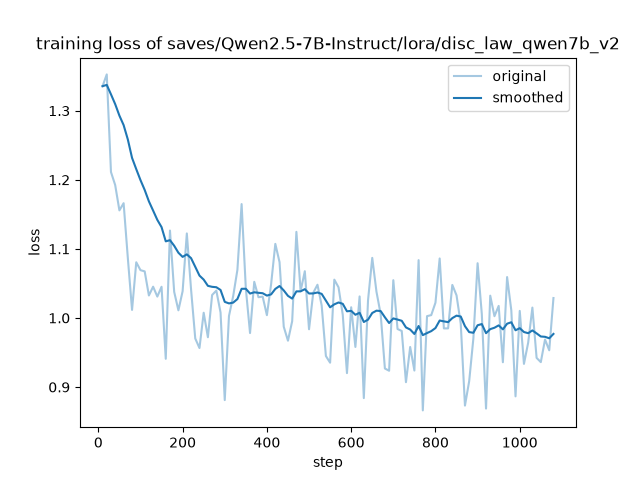
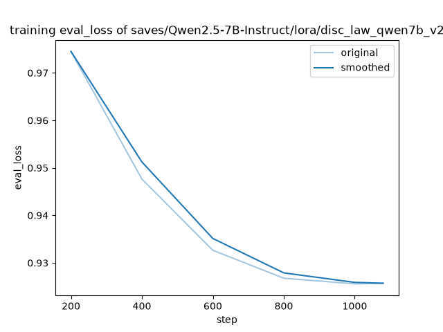

# Qwen2.5-7B 劳动法 LoRA 微调证明材料

本目录用于证明本项目实际完成了基于 LLaMA-Factory 的 Qwen2.5-7B 劳动法 QLoRA 微调、数据构建、版本迭代与评测。材料覆盖 v1、v2、v3、v3.1 四轮实验；其中 v2 是最终采用版本，v3/v3.1 作为数据清洗和超参调整的消融记录。

为避免 GitHub 仓库过大，本目录只保留可审查、可复现实验过程的小体积材料，不提交 5GB+ checkpoint、155MB LoRA 权重文件，也不提交完整 DISC 派生训练集。

建议老师/评审从这两个文件开始看：

- [`FULL_PROCESS_SUMMARY.md`](./FULL_PROCESS_SUMMARY.md)：v1 → v2 → v3 → v3.1 的训练配置、指标、结论总览。
- [`data_pipeline/DATASET_MANIFEST.md`](./data_pipeline/DATASET_MANIFEST.md)：数据筛选、清洗、注册、样本统计和样例说明。

## 1. 微调任务概况

| 项目 | 内容 |
| --- | --- |
| 基座模型 | Qwen2.5-7B-Instruct |
| 训练框架 | LLaMA-Factory |
| 微调方式 | QLoRA / LoRA SFT |
| 量化方式 | 4bit bitsandbytes |
| 目标领域 | 劳动法问答 |
| 数据来源 | DISC-Law-SFT Pair/Triplet QA，经劳动法关键词筛选和清洗 |
| 实验版本 | v1、v2、v3、v3.1 |
| LoRA 参数 | `r=16`，`alpha=32`，`dropout=0.05`，`target=all` |
| 最终版本 | `disc_law_qwen7b_v2` |

核心配置见：

- 训练配置：[`configs/training/`](./configs/training/)
- 推理配置：[`configs/inference/`](./configs/inference/)
- 数据注册片段：[`data_pipeline/dataset_info_disc_law_excerpt.json`](./data_pipeline/dataset_info_disc_law_excerpt.json)

## 2. 版本迭代材料

| 版本 | 主要目的 | 已提交证明材料 |
| --- | --- | --- |
| v1 | 初版劳动法子集 + QLoRA 流程验证 | 训练配置、训练日志、Base vs LoRA 20题对比 |
| v2 | 扩充 Pair 4000 + Triplet 5000，降低学习率，最终采用 | 训练配置、训练日志、指标 JSON、loss 曲线、Base vs LoRA 20题对比 |
| v3 | 更严格数据清洗，加入 gold eval 样本，提高学习率做对比 | 训练配置、训练日志、指标 JSON、loss 曲线、Base vs LoRA 20题对比 |
| v3.1 | 在 v3 数据上回调学习率和 cutoff_len，验证是否优于 v2 | 训练配置、训练日志、指标 JSON、loss 曲线 |

训练日志：

- [`logs/disc_law_qwen7b_v1_train.log`](./logs/disc_law_qwen7b_v1_train.log)
- [`logs/disc_law_qwen7b_v2_train.log`](./logs/disc_law_qwen7b_v2_train.log)
- [`logs/disc_law_qwen7b_v3_train.log`](./logs/disc_law_qwen7b_v3_train.log)
- [`logs/disc_law_qwen7b_v3_1_train.log`](./logs/disc_law_qwen7b_v3_1_train.log)

## 3. 最终采用版本 v2 指标

v2 训练完成后的关键指标如下，原始 JSON 文件保存在 [`metrics/v2/`](./metrics/v2/)：

| 指标 | 数值 |
| --- | ---: |
| `epoch` | 2.0 |
| `train_loss` | 0.4370 |
| `eval_loss` | 0.9257 |
| `train_runtime` | 2700.6786 秒 |
| `train_samples_per_second` | 6.395 |
| `train_steps_per_second` | 0.400 |
| `eval_runtime` | 39.5244 秒 |
| `eval_samples_per_second` | 11.512 |

对应文件：

- [`metrics/v2/train_results.json`](./metrics/v2/train_results.json)
- [`metrics/v2/eval_results.json`](./metrics/v2/eval_results.json)
- [`metrics/v2/all_results.json`](./metrics/v2/all_results.json)
- [`metrics/v2/trainer_log.jsonl`](./metrics/v2/trainer_log.jsonl)
- [`metrics/v2/trainer_state.json`](./metrics/v2/trainer_state.json)

日志末尾显示训练达到 `1080/1080` steps，最终 `epoch=2.0`，并输出 `eval_loss=0.9256919026374817`。

## 4. Loss 曲线

v2 训练 loss 曲线：



v2 验证集 eval loss 曲线：



更多版本曲线：

- [`plots/v3/training_loss.png`](./plots/v3/training_loss.png)
- [`plots/v3/training_eval_loss.png`](./plots/v3/training_eval_loss.png)
- [`plots/v3_1/training_loss.png`](./plots/v3_1/training_loss.png)
- [`plots/v3_1/training_eval_loss.png`](./plots/v3_1/training_eval_loss.png)

## 5. Base vs LoRA 评测

为了验证微调效果，本项目额外准备了 20 道劳动法问答，对比基座模型与各版 LoRA 的回答表现。

评测材料：

- 评测集：[`eval/disc_law_eval_20.json`](./eval/disc_law_eval_20.json)
- 评测脚本：[`eval/run_base_vs_lora.py`](./eval/run_base_vs_lora.py)、[`eval/run_base_v2_compare.py`](./eval/run_base_v2_compare.py)、[`eval/run_base_v3_compare.py`](./eval/run_base_v3_compare.py)
- v1 对比结果：[`eval/results/compare_20260621_235916.md`](./eval/results/compare_20260621_235916.md)
- v2 对比结果：[`eval/results/compare_v2_20260622_024854.md`](./eval/results/compare_v2_20260622_024854.md)
- v3 对比结果：[`eval/results/compare_v3_20260622_231008.md`](./eval/results/compare_v3_20260622_231008.md)

典型观察：

1. 在「公司可以随意辞退员工吗？」等问题上，基座模型更偏通用原则解释；v2 LoRA 会直接列出《劳动合同法》第三十九条的具体法定情形。
2. 在「劳动合同法第19条主要内容是什么？」等条号题上，v2 LoRA 更倾向输出试用期期限相关规定，法律答复体例更明显。
3. v3/v3.1 虽然做了更严格的数据清洗和超参调整，但综合 loss 与 20 题表现未优于 v2，因此最终保留 v2 作为项目部署版本。
4. 在 RAG 强约束场景下，基座和 LoRA 输出可能趋同；无 RAG 或条号精确题更能体现微调收益。

## 6. 数据构建证明

数据相关证明位于 [`data_pipeline/`](./data_pipeline/)：

- [`data_pipeline/DATASET_MANIFEST.md`](./data_pipeline/DATASET_MANIFEST.md)：各版本数据文件样本数、大小和用途。
- [`data_pipeline/scripts/`](./data_pipeline/scripts/)：DISC-Law-SFT 劳动法子集筛选、清洗、构建脚本。
- [`data_pipeline/samples/`](./data_pipeline/samples/)：各训练/评测数据文件前 5 条样例。
- [`data_pipeline/dataset_info_disc_law_excerpt.json`](./data_pipeline/dataset_info_disc_law_excerpt.json)：LLaMA-Factory 数据集注册片段。

完整训练集未直接提交，原因是其来自 DISC-Law-SFT 的派生数据，且完整 `DISC-Law-SFT/` 本地目录约 305MB。仓库中保留脚本、统计和样例即可证明数据处理流程。

## 7. 为什么没有提交权重文件

本次实际产出的 LoRA 权重文件为：

```text
saves/Qwen2.5-7B-Instruct/lora/disc_law_qwen7b_v2/adapter_model.safetensors
```

该文件约 155MB，超过 GitHub 普通仓库单文件 100MB 限制；完整 `saves/Qwen2.5-7B-Instruct` 目录约 5.2GB，包含多个实验版本和 checkpoint，不适合提交到课程项目仓库。

因此，本仓库只提交以下证明材料：

- 训练配置
- 推理配置
- 训练日志
- 训练与验证指标
- loss 曲线
- Base vs LoRA 评测脚本与结果
- 数据构建脚本、注册片段、统计表和样例

这些材料已经可以证明完整微调流程真实执行过，并能复现实验设置、版本迭代和结果分析。

